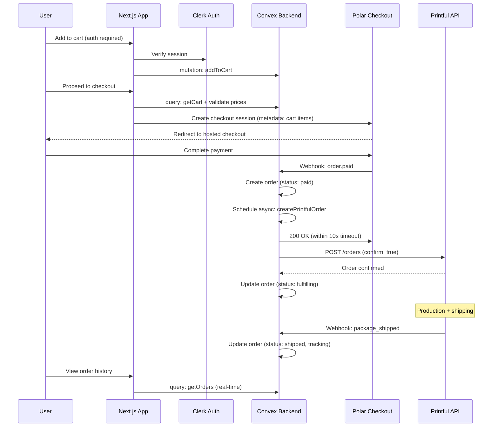
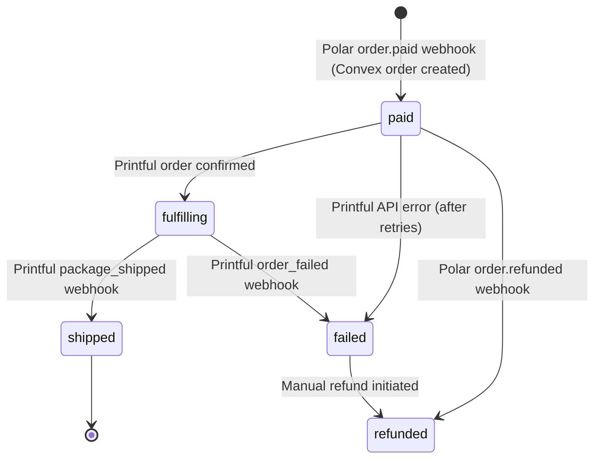
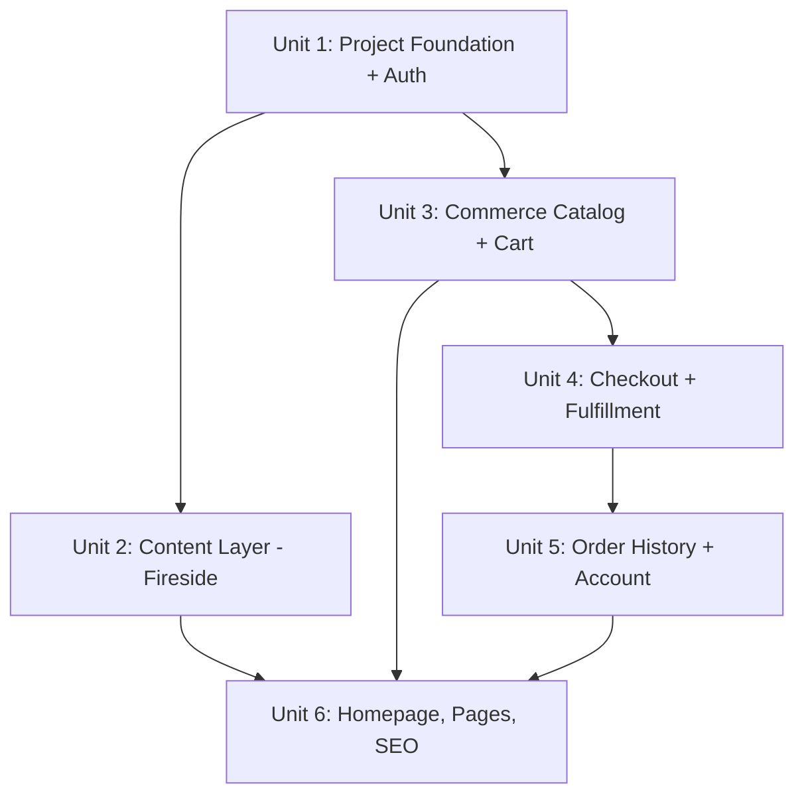

---

## title: "feat: Build Wildflower Media v2 Commerce-First MVP"

type: feat
status: active
date: 2026-04-11
origin: docs/brainstorms/2026-04-10-wildflower-media-v2-mvp-requirements.md
deepened: 2026-04-11

# feat: Build Wildflower Media v2 Commerce-First MVP

## Overview

Replace the existing WordPress/Elementor site at wildflowerpodcasts.com with a Next.js application on Vercel that serves as a media brand hub for two podcasts (The Music Snobs, Snobs On Film) and generates revenue through print-on-demand t-shirt sales. Episodes are sourced from Fireside RSS feeds; commerce is powered by Printful (catalog + fulfillment), Polar (checkout + payments), Clerk (authentication), and Convex (backend data).

## Problem Frame

Wildflower Media's current WordPress site is a passive RSS support layer that provides minimal value beyond feed hosting. The owner wants to move away from WordPress/Elementor and transform the site into a lightweight media brand hub that generates direct revenue through merchandise, while building toward future sponsorship and community features. (see origin: `docs/brainstorms/2026-04-10-wildflower-media-v2-mvp-requirements.md`)

## Requirements Trace

- R1. Platform migration: WordPress → Next.js on Vercel, maintain wildflowerpodcasts.com domain
- R2. Episode source: Fireside as source of truth, pulled via RSS at build/ISR time
- R3. Show structure: Dedicated landing pages for The Music Snobs and Snobs On Film
- R4. User authentication: Clerk with email/password and social login (Google, Apple)
- R5. Product catalog: Print-on-demand t-shirts via Printful API
- R6. Shopping cart: Persistent per-user cart in Convex (auth required to add items)
- R7. Checkout: Polar-powered payment with post-payment Printful fulfillment
- R8. Order history: Authenticated users view order status with real-time updates
- R9. Homepage: Hero featuring both shows, recent episodes, and shop CTA
- R10. Episode display: Recent episodes per show with Fireside embed player
- R11. About/Network page: Wildflower Media description, hosts, contact info
- R12. Social sharing: Share buttons on episode pages, track events in Convex
- R13. Sponsor page: Contact form placeholder for sponsorship inquiries

## Scope Boundaries

- **In scope:** Next.js site, Clerk auth, Printful catalog + Polar checkout, show pages, homepage, Fireside episode embedding (last 10–20), social sharing buttons, sponsor contact form, SEO redirect mapping
- **Out of scope:** Full WordPress content migration, self-serve sponsorship portal, social rewards program (tracking only), user-generated content, email newsletters, mobile apps, advanced analytics, guest carts (auth required for cart operations)
- **MVP simplification:** Cart requires authentication — no guest localStorage cart or merge logic. This defers complexity to a future phase while keeping the checkout flow clean. (Diverges from the origin brainstorm's "or localStorage for guests" option per user decision during planning.)

## Context & Research

### Relevant Code and Patterns

This is a greenfield project — no existing codebase patterns. The repo contains only documentation (`docs/brainstorms/` and `docs/plans/`).

### External References

- **Fireside RSS as data source:** Fireside's REST API is metrics-focused (download stats). Full episode content (titles, descriptions, artwork, audio URLs, embed codes) lives in the RSS feed at `https://{show}.fireside.fm/rss`. RSS includes custom `<fireside:playerUrl>` and `<fireside:playerEmbedCode>` elements for per-episode embedding.
- **Printful API:** Private token auth via Bearer header. Sync Products endpoints (`GET /store/products`, `GET /store/products/{id}`) for catalog. V1 order creation with `confirm: true` for single-step fulfillment. Rate limits: 120 req/min general, 10 req/min sync products. Webhooks for `package_shipped`, `order_failed`, `order_put_hold`.
- **Polar checkout:** Creates hosted checkout sessions via `@polar-sh/sdk`. No native cart — cart metadata (items, variant IDs, quantities, prices) passed via checkout session `metadata` field. `@polar-sh/nextjs` provides `Checkout` and `Webhooks` helpers. 10-second webhook timeout — must respond immediately and process async. Key events: `order.paid` (fulfillment trigger), `order.refunded`.
- **Clerk + Convex:** `ConvexProviderWithClerk` for combined auth. `clerkMiddleware()` with `createRouteMatcher` for route protection. `auth()` is async in Clerk v6+. Webhook endpoints must be in public routes list.
- **Convex architecture:** HTTP Actions (`convex/http.ts`) for receiving external webhooks directly — eliminates network hop vs Next.js API routes. `ctx.scheduler.runAfter(0, ...)` for async fulfillment after webhook processing. Mutations are transactional and auto-retry; actions are at-most-once. `useQuery` subscriptions provide real-time cart and order status updates.
- **Reference implementation:** `polar-commerce` (GitHub) implements Next.js + Convex + Polar with cart bundling and webhook reconstruction.

## Key Technical Decisions

- **Fireside RSS over API:** The Fireside REST API returns only metrics/download stats, not full episode content. RSS feeds provide titles, descriptions, artwork, audio URLs, and embed player codes. Fetching RSS at build time via ISR eliminates rate limit concerns entirely.
- **Convex HTTP Actions for webhooks:** Polar and Printful webhooks land in Convex HTTP Actions rather than Next.js API routes. This gives webhook handlers direct transactional access to the database without an extra network hop, and leverages Convex's built-in scheduling for async fulfillment work.
- **Printful V1 for orders:** V1's single-step order creation (`confirm: true`) is simpler than V2's draft-then-confirm flow. V2's sync product endpoints are not yet available, so V1 is required for catalog anyway. Consistent V1 usage avoids mixing API versions.
- **Auth-required cart:** Cart operations require Clerk authentication. This eliminates guest cart complexity (localStorage, merge-on-login, conflict resolution) while keeping the MVP timeline achievable. Users can browse products freely but must sign in to add items.
- **Polar metadata for cart bundling:** Since Polar has no native cart, cart contents are passed as metadata on the checkout session. Server-side price validation against Printful ensures the metadata hasn't been tampered with. The Convex order record is the source of truth, not the Polar metadata.
- **Order state machine:** Orders are created in Convex when the Polar `order.paid` webhook fires (status: `paid`). Pre-payment state (`pending`) exists only in Polar, not in Convex. The lifecycle from Convex's perspective: `paid` → `fulfilling` → `shipped` (with `failed` and `refunded` branches). Each state transition maps to a specific Polar or Printful webhook event.

## Open Questions

### Resolved During Planning

- **Fireside data source:** RSS feeds, not the REST API. The API is metrics-only and lacks episode content. RSS provides all needed fields including custom Fireside embed player elements.
- **Printful API auth and endpoints:** Private token via Bearer header. `GET /store/products` for catalog, `POST /orders` with `confirm: true` for fulfillment. Rate limits documented (120/min general, 10/min sync products).
- **Polar webhook for fulfillment:** `order.paid` event triggers fulfillment. `@polar-sh/nextjs` Webhooks helper handles signature verification. Metadata field carries cart reconstruction data.
- **Guest vs auth cart:** Auth-required cart chosen to reduce MVP complexity. Guest browsing is unrestricted.

### Deferred to Implementation

- **WordPress URL structure audit:** Current URL patterns need to be audited from the live site to build a complete 301 redirect map. The specific URL format (`/episode-slug` vs `/show/episode-slug` vs `/yyyy/mm/dd/slug`) is only knowable by inspecting the live WordPress site.
- **Fireside feed URLs:** The exact RSS feed URLs for The Music Snobs and Snobs On Film need to be confirmed from the Fireside dashboard. The pattern is `https://{show-slug}.fireside.fm/rss` but the exact slugs may differ.
- **Printful store product IDs:** The specific sync product and variant IDs for the t-shirt designs depend on the Printful store setup. Implementation will discover these via the API.
- **Polar product configuration:** Polar product IDs need to be created in the Polar dashboard to match the Printful catalog. The exact product-to-variant mapping is an implementation detail.

## High-Level Technical Design

> *This illustrates the intended approach and is directional guidance for review, not implementation specification. The implementing agent should treat it as context, not code to reproduce.*

### Commerce Pipeline (Checkout → Fulfillment)

### Order State Machine

*Note: Pre-payment state (`pending`) exists only in Polar's hosted checkout. Convex records begin at `paid`.*

## Implementation Units

- **Unit 1: Project Foundation + Authentication**

**Goal:** Scaffold the Next.js application with all infrastructure dependencies, configure Clerk authentication with Convex integration, and define the complete Convex schema.

**Requirements:** R1, R4

**Dependencies:** None — foundational unit

**Files:**

- Create: `package.json`, `tsconfig.json`, `next.config.ts`, `tailwind.config.ts`
- Create: `app/layout.tsx`, `app/providers.tsx`, `app/globals.css`
- Create: `middleware.ts`
- Create: `convex/schema.ts`, `convex/auth.config.ts`, `convex/http.ts`
- Create: `convex/users.ts`
- Create: `app/sign-in/[[...sign-in]]/page.tsx`, `app/sign-up/[[...sign-up]]/page.tsx`
- Create: `lib/utils.ts`
- Create: `.env.example`

**Approach:**

- Initialize Next.js with App Router, TypeScript, Tailwind CSS v4, and shadcn/ui
- Install core dependencies: `@clerk/nextjs`, `convex`, `@polar-sh/sdk`, `@polar-sh/nextjs`
- Root layout wraps `ClerkProvider` → `ConvexProviderWithClerk` (Clerk must be outer provider)
- `clerkMiddleware()` with `createRouteMatcher` protecting `/cart`, `/checkout`, `/orders` routes; content pages are public. Webhook endpoints live on the Convex deployment URL (not Next.js `/api/` routes), so they bypass Clerk middleware entirely
- Convex schema defines all tables upfront: `users`, `cartItems`, `orders`, `shareEvents` with appropriate indexes
- Convex HTTP router (`convex/http.ts`) scaffolded with placeholder routes for Polar and Printful webhooks
- User sync: Clerk webhook or `useEffect` on first login creates/updates the Convex user record from Clerk identity

**Patterns to follow:**

- Convex `ConvexProviderWithClerk` pattern from official Convex + Clerk docs
- `createRouteMatcher` pattern from Clerk Next.js docs
- Convex schema with `v.union(v.literal(...))` for enum-like fields

**Test scenarios:**

- Happy path: Unauthenticated user can access homepage, show pages, shop page without redirect
- Happy path: Unauthenticated user accessing `/cart` or `/checkout` is redirected to sign-in
- Happy path: User signs in via email/password, Convex user record is created with correct `clerkId`
- Happy path: User signs in via Google OAuth, returns to intended page
- Edge case: User with existing Convex record signs in again — record is not duplicated
- Error path: Invalid Clerk configuration surfaces clear error in development
- Integration: ClerkProvider → ConvexProviderWithClerk chain correctly propagates auth state to Convex queries

**Verification:**

- `npm run dev` starts without errors
- Sign-in and sign-up flows complete successfully
- Protected routes redirect unauthenticated users
- Convex dashboard shows user record after first login
- `npx convex dev` deploys schema without errors

---

- **Unit 2: Content Layer — Fireside Episodes**

**Goal:** Build the podcast content pages that display recent episodes from Fireside RSS feeds with embedded players for both shows.

**Requirements:** R2, R3, R10

**Dependencies:** Unit 1 (app scaffold, layout)

**Files:**

- Create: `lib/fireside.ts`
- Create: `app/shows/page.tsx`
- Create: `app/shows/[slug]/page.tsx`
- Create: `components/episode-card.tsx`
- Create: `components/episode-player.tsx`
- Test: `lib/__tests__/fireside.test.ts`

**Approach:**

- RSS parser utility using `rss-parser` package with custom field extraction for `fireside:playerUrl` and `fireside:playerEmbedCode`
- Show pages use ISR with `revalidate = 3600` (1 hour) — episodes publish weekly at most
- `generateStaticParams` pre-builds pages for both show slugs
- Episode display shows artwork, title, publish date, and Fireside iframe embed player
- Limit to last 20 episodes per show; prominent "Full archive on Fireside" link for older content
- Show page layout: show artwork + description at top, episode list below
- Episode player component renders Fireside iframe embed with dark theme option

**Patterns to follow:**

- Next.js ISR with `revalidate` export in page components
- `rss-parser` custom fields configuration for Fireside namespace elements

**Test scenarios:**

- Happy path: RSS parser extracts title, description, pubDate, audioUrl, playerUrl, and embedCode from a Fireside RSS fixture
- Happy path: Show page renders 20 episodes in reverse chronological order with correct metadata
- Happy path: Episode embed player renders an iframe with correct Fireside player URL
- Edge case: RSS feed returns fewer than 20 episodes — page renders all available without error
- Edge case: Episode missing `fireside:playerEmbedCode` — falls back to audio link or "Listen on Fireside" link
- Error path: RSS feed fetch fails during ISR — page serves stale cached version (Next.js ISR behavior)
- Error path: Malformed RSS item (missing title or enclosure) — skipped without crashing the page

**Verification:**

- Both show pages render at `/shows/music-snobs` and `/shows/snobs-on-film`
- Episode cards display artwork, title, date, and working embed player
- Page loads within performance budget (ISR serves static HTML)
- "Full archive" link navigates to the correct Fireside.fm URL

---

- **Unit 3: Commerce — Product Catalog + Cart**

**Goal:** Display t-shirt products from Printful and implement the authenticated shopping cart with Convex persistence.

**Requirements:** R5, R6

**Dependencies:** Unit 1 (auth, Convex schema)

**Files:**

- Create: `lib/printful.ts`
- Create: `app/shop/page.tsx`
- Create: `app/shop/[productId]/page.tsx`
- Create: `components/product-card.tsx`
- Create: `components/product-detail.tsx`
- Create: `components/cart-drawer.tsx`
- Create: `components/cart-item.tsx`
- Create: `convex/cartItems.ts`
- Test: `lib/__tests__/printful.test.ts`
- Test: `convex/__tests__/cartItems.test.ts`

**Approach:**

- Printful API client wraps `GET /store/products` and `GET /store/products/{id}` with Bearer token auth and response typing
- Shop page fetches products at build time via ISR (`revalidate = 300`, 5 minutes) to respect Printful's 10 req/min sync product rate limit
- Product detail page shows images, available sizes/colors as selectable variants, and price
- Cart drawer (slide-out panel) shows current items with quantity controls and subtotal
- Convex mutations: `addToCart` (upserts by variant ID), `removeFromCart`, `updateQuantity`, `clearCart`
- Convex query: `getCartItems` returns all items for the authenticated user with real-time updates
- All cart operations verify auth via `ctx.auth.getUserIdentity()` — never trust client-passed userId
- Cart item count badge in the site header for persistent visibility

**Patterns to follow:**

- Convex `ctx.auth.getUserIdentity()` for server-side auth verification in all mutations
- shadcn/ui Sheet component for cart drawer
- ISR page with `revalidate` for product catalog

**Test scenarios:**

- Happy path: Shop page displays all Printful sync products with images, names, and starting price
- Happy path: Product detail page shows all available sizes and colors with correct pricing per variant
- Happy path: Authenticated user adds item to cart — cart count updates in header, drawer shows item
- Happy path: User changes quantity in cart — subtotal recalculates correctly
- Happy path: User removes item from cart — item disappears, totals update
- Edge case: User adds same variant twice — quantity increments rather than creating duplicate entry
- Edge case: Product with single variant (one size/color) — size selector hidden, add-to-cart works directly
- Error path: Printful API returns error during ISR — page serves stale cached version
- Error path: Unauthenticated user attempts cart mutation — Convex rejects with auth error
- Integration: Cart updates in real-time across multiple browser tabs via Convex subscription

**Verification:**

- Products display with correct images and pricing from Printful
- Cart persists across page navigation and browser refresh
- Cart drawer opens/closes smoothly with correct items and totals
- Cart badge in header reflects current item count

---

- **Unit 4: Checkout + Order Fulfillment Pipeline**

**Goal:** Implement the end-to-end payment flow: create Polar checkout sessions from the cart, receive payment webhooks, create Printful fulfillment orders, and handle the order state machine.

**Requirements:** R7

**Dependencies:** Unit 3 (cart, Printful client)

**Files:**

- Create: `app/checkout/page.tsx`
- Create: `app/orders/confirmation/page.tsx`
- Create: `convex/orders.ts`
- Create: `convex/fulfillment.ts`
- Modify: `convex/http.ts` (add Polar and Printful webhook handlers)
- Create: `lib/polar.ts`
- Test: `convex/__tests__/orders.test.ts`
- Test: `convex/__tests__/fulfillment.test.ts`

**Approach:**

- Checkout page: validates cart (server-side price check against Printful), creates Polar checkout session with cart metadata (variant IDs, quantities, unit prices, user ID), redirects to Polar hosted checkout
- Polar checkout session includes `successUrl` pointing to `/orders/confirmation?checkout_id={CHECKOUT_ID}` and `externalCustomerId` set to Clerk user ID
- Polar `order.paid` webhook lands at Convex HTTP Action: verify signature → create/update Convex order (status: `paid`) → `ctx.scheduler.runAfter(0, ...)` to trigger Printful order creation → return 200 within 2 seconds
- Printful fulfillment action: `POST /orders` with `confirm: true`, recipient address sourced from the Polar webhook payload (Polar collects shipping during checkout), items mapped from validated cart metadata. Store `printfulOrderId` on order record. Retry with backoff on transient failures.
- Printful `package_shipped` webhook: update order status to `shipped`, store tracking number and URL
- Printful `order_failed` webhook: update order status to `failed`, log for ops attention
- Confirmation page: polls Convex for order by `polarCheckoutId` with loading state (handles race between user redirect and webhook)
- Idempotency: check `polarCheckoutId` unique index before creating duplicate orders; webhook handlers no-op if order already in target state

**Patterns to follow:**

- Manual Polar webhook signature verification inside Convex `httpAction` (the `@polar-sh/nextjs` `Webhooks` helper targets Next.js Route Handlers and cannot be used directly in Convex — verify using raw body + `Polar-Signature` header + webhook secret)
- Convex `httpAction` for webhook endpoints, `internalAction` for Printful API calls
- Convex `ctx.scheduler.runAfter` for async work after webhook response

**Test scenarios:**

- Happy path: User with items in cart clicks checkout → Polar session created with correct product/metadata → user redirected to Polar
- Happy path: After successful payment, Polar webhook creates Convex order with status `paid` and correct line items
- Happy path: Fulfillment action creates Printful order with correct recipient and items, order status transitions to `fulfilling`
- Happy path: Printful `package_shipped` webhook updates order to `shipped` with tracking info
- Happy path: Confirmation page shows order summary after webhook processes
- Edge case: User hits confirmation page before webhook fires — page shows loading state, then populates when order appears
- Edge case: Duplicate Polar webhook (same event ID) — second invocation is a no-op, no duplicate order
- Edge case: Cart changes after checkout session created — stale session's metadata doesn't match current cart (checkout should recreate session from current cart)
- Error path: Polar webhook with invalid signature — rejected with 401, no order mutation
- Error path: Printful API down after payment — order stays in `paid` status, fulfillment retried via scheduled function
- Error path: Printful rejects order (invalid address, retired SKU) — order status set to `failed`, logged for manual resolution
- Integration: Full pipeline: cart → Polar checkout → webhook → Convex order → Printful order → status updates visible in real-time

**Verification:**

- End-to-end checkout completes in Polar sandbox with test card
- Convex order record shows correct status transitions
- Printful order appears in Printful dashboard after webhook
- Confirmation page displays order details after payment
- Duplicate webhooks do not create duplicate orders

---

- **Unit 5: Order History + Account**

**Goal:** Allow authenticated users to view their order history with real-time status updates powered by Convex subscriptions.

**Requirements:** R8

**Dependencies:** Unit 4 (order records in Convex)

**Files:**

- Create: `app/orders/page.tsx`
- Create: `app/orders/[orderId]/page.tsx`
- Create: `components/order-card.tsx`
- Create: `components/order-status-badge.tsx`
- Modify: `convex/orders.ts` (add `getOrdersByUser`, `getOrderById` queries)

**Approach:**

- Order list page shows all orders for the authenticated user, sorted by most recent, with status badge, date, total, and item summary
- Order detail page shows full line items, shipping address, status timeline, and tracking link (when shipped)
- Status badges map internal states to user-friendly labels: `paid` → "Processing", `fulfilling` → "Being Made", `shipped` → "Shipped", `failed` → "Issue — Contact Us", `refunded` → "Refunded"
- Both pages use Convex `useQuery` for real-time updates — when a webhook updates order status, the UI reflects it immediately without refresh
- Queries verify auth via `ctx.auth.getUserIdentity()` and filter by the authenticated user's ID

**Patterns to follow:**

- Convex reactive `useQuery` for automatic UI updates on status change
- shadcn/ui Badge component for status display

**Test scenarios:**

- Happy path: User with multiple orders sees them listed in reverse chronological order with correct status badges
- Happy path: Order detail page shows all line items, quantities, prices, and shipping address
- Happy path: When order status changes (e.g., `fulfilling` → `shipped`), badge updates in real-time without page refresh
- Happy path: Shipped order shows clickable tracking link
- Edge case: User with no orders sees empty state with "Browse the shop" CTA
- Edge case: Order in `failed` status shows appropriate messaging and contact information
- Error path: Unauthenticated access to `/orders` redirects to sign-in
- Integration: Status change from Printful webhook propagates to the order detail page in real-time

**Verification:**

- Order list displays correct orders for the logged-in user
- Status badges reflect current order state
- Tracking link works for shipped orders
- Real-time updates visible when order status changes

---

- **Unit 6: Homepage, Static Pages, Social Sharing, SEO + Deploy**

**Goal:** Build the homepage, about page, sponsor placeholder, social sharing, SEO foundations, WordPress redirect mapping, and prepare for Vercel deployment.

**Requirements:** R1, R9, R11, R12, R13

**Dependencies:** Units 2 (episode data), 3 (product data), 5 (order history exists for nav)

**Files:**

- Create: `app/page.tsx` (homepage)
- Create: `app/about/page.tsx`
- Create: `app/sponsor/page.tsx`
- Create: `components/hero-section.tsx`
- Create: `components/share-buttons.tsx`
- Create: `convex/shareEvents.ts`
- Modify: `app/shows/[slug]/page.tsx` (add share buttons to episode display)
- Create: `app/sitemap.ts`
- Create: `app/robots.ts`
- Modify: `next.config.ts` (add redirects)
- Create: `vercel.json` (if needed beyond next.config)

**Approach:**

- **Homepage:** Hero section featuring both show logos/artwork, latest 3–5 episodes per show (from Fireside RSS via shared utility), and prominent "Shop T-Shirts" CTA linking to `/shop`. ISR with same revalidation as show pages.
- **About page:** Static content — Wildflower Media description, host bios, show descriptions, and contact info. Purely static, no data fetching.
- **Sponsor page:** Simple contact form (name, email, message) that submits to a Convex mutation or sends via a service like Resend. "Interested in sponsoring our shows?" framing. No self-serve features.
- **Social sharing:** Share buttons component (Twitter/X, Facebook, copy link) added to episode display on show pages. On share, fire-and-forget Convex mutation records the event in `shareEvents` table for Phase 2 analytics. Share failure does not block the share action.
- **SEO:** `generateMetadata` on all pages with appropriate titles, descriptions, and OG images. Sitemap at `/sitemap.xml` listing shows, shop, and about pages. `robots.ts` allowing all crawlers.
- **WordPress redirects:** Audit current WordPress URL structure from the live site. Add 301 redirects in `next.config.ts` `redirects()` to preserve SEO rankings for existing URLs. This is partially deferred to implementation — the redirect map depends on auditing the live WordPress site.
- **Vercel deployment:** Configure `vercel.json` if needed. Environment variables for Clerk, Convex, Polar, Printful, Fireside. Domain configuration for wildflowerpodcasts.com DNS cutover.

**Patterns to follow:**

- Next.js `generateMetadata` for per-page SEO
- Next.js `sitemap.ts` and `robots.ts` conventions
- Next.js `redirects()` in config for 301 mapping
- shadcn/ui components for UI elements

**Test scenarios:**

- Happy path: Homepage renders hero with both shows, recent episodes, and shop CTA
- Happy path: About page renders static content with host information
- Happy path: Sponsor page form submits successfully and shows confirmation message
- Happy path: Share button on episode page opens Twitter/X share dialog with correct episode URL and title
- Happy path: Copy link button copies episode URL to clipboard and shows success toast
- Happy path: Share event is recorded in Convex `shareEvents` table with correct episode slug and platform
- Edge case: Share tracking mutation fails — share action still completes for the user (non-blocking)
- Edge case: Sponsor form submitted with empty fields — validation prevents submission
- Error path: Homepage episode fetch fails — shows shop CTA and static content, episode section degrades gracefully
- Integration: WordPress redirect (e.g., old `/2024/01/episode-name/`) returns 301 to new URL structure

**Verification:**

- Homepage loads under 2 seconds (Lighthouse performance target)
- All pages have correct meta tags and OG data
- Sitemap is accessible and lists all public pages
- WordPress redirects return 301 status codes
- Social share buttons function on all major platforms
- Sponsor form delivers messages successfully
- Vercel deployment serves the site on the target domain

## System-Wide Impact

- **Interaction graph:** Polar `order.paid` webhook → Convex HTTP Action → Convex mutation (create order) → Convex scheduled action (Printful order). Printful `package_shipped` webhook → Convex HTTP Action → Convex mutation (update order). Clerk auth state → Convex auth context for all mutations/queries. Fireside RSS → ISR page generation.
- **Webhook idempotency and ordering:** Every webhook handler must deduplicate by provider event ID (Polar event ID, Printful webhook ID). Polar can deliver events out of order or retry — handlers must be safe for duplicate and reordered delivery. The Convex order record keyed by `polarCheckoutId` serves as the idempotency boundary: if an order already exists for that checkout, the webhook is a no-op.
- **Error propagation:** Webhook signature failures reject at the HTTP Action layer (no DB writes). Convex mutations auto-retry on transient failures but **not** on validation errors (missing SKU mapping, business-rule violations) — these must be classified as terminal and surfaced for ops. Frontend errors in Polar checkout are handled by Polar's hosted UI.
- **Scheduled action failure handling:** Convex actions are at-most-once. The Printful fulfillment action must use the Convex order ID as Printful's `external_id` so that retries or reconciliation cannot create duplicate Printful orders. Failures are classified as: **retryable** (Printful 5xx, timeout) → schedule another attempt with backoff, cap at 5 retries; **terminal** (invalid address, retired SKU, auth failure) → set order status to `failed`, log for ops. A periodic reconciliation query should scan for orders in `paid` status older than 15 minutes without a `printfulOrderId` — these represent missed or failed fulfillment.
- **Cart lifecycle:** Cart is cleared only after the Polar webhook confirms payment and the Convex order is created — never optimistically on redirect. If two tabs create checkout sessions from the same cart, the first successful payment creates the order and clears the cart; the second session's webhook finds the cart already cleared and becomes a no-op (idempotent by checkout ID).
- **Refund/chargeback compensation:** Polar `order.refunded` webhook updates order status to `refunded`. If Printful order is still in `draft` or `pending`, attempt cancellation via Printful API. If already `in_production` or `shipped`, cancellation is not possible — log for manual resolution (operational loss accepted for MVP). Chargebacks follow the same path.
- **State lifecycle risks:** Race between user redirect and webhook on confirmation page — handle with polling/loading state. Abandoned Polar checkouts leave cart unchanged (no side effects). Stale ISR pages for products resolve on next revalidation; for price-sensitive displays, the checkout flow re-validates against Printful before creating the Polar session.
- **Auth boundaries:** Three distinct auth contexts: (1) **User sessions** — Clerk JWT verified by Convex `ctx.auth.getUserIdentity()` for cart and order queries/mutations; (2) **External webhooks** — Polar/Printful HMAC signature verification, no Clerk session, webhook endpoints explicitly in Clerk's public route list; (3) **Internal scheduled actions** — Convex internal functions called via `ctx.scheduler`, no user auth, operate on order data directly. These must never be conflated.
- **Observability:** Use `polarCheckoutId` as the correlation ID across the Polar → Convex → Printful pipeline. Log this ID at every state transition. Alert on: webhook error rate > threshold, orders stuck in `paid` for > 15 minutes, Printful API error rate, refund webhooks for orders with active shipments.
- **API surface parity:** Primary consumer is a single Next.js frontend. Additionally, Convex HTTP Actions serve as authenticated-by-signature public interfaces for Polar and Printful webhooks — these require their own verification, idempotency, and monitoring independent of the frontend.
- **Integration coverage:** The Polar → Convex → Printful pipeline is the critical cross-service flow. Unit tests cannot prove this end-to-end. Testing contracts: (1) pay → webhook → order + Printful, (2) duplicate webhook → no duplicate order, (3) fulfillment failure after N retries → order in `failed` state visible to ops, (4) Printful shipment webhook → order status + tracking updated in real-time.
- **Unchanged invariants:** Fireside remains the source of truth for episode content — this site is purely a presentation and commerce layer. RSS feeds and Fireside embeds are consumed read-only. No content is written back to any external service except Printful (orders) and Polar (checkout sessions).

## Risks & Dependencies

| Risk                                                       | Mitigation                                                                                                                                                                                                                                                               |
| ---------------------------------------------------------- | ------------------------------------------------------------------------------------------------------------------------------------------------------------------------------------------------------------------------------------------------------------------------ |
| **Payment idempotency — duplicate orders or fulfillment**  | Deduplicate by Polar event ID and `polarCheckoutId` unique index in Convex. Printful orders use Convex order ID as `external_id` to prevent duplicate submissions. Reconciliation query catches drift.                                                                   |
| **Post-payment source of truth mismatch**                  | Server-side per-line-item validation (SKU, quantity, unit price) against Printful before creating Polar session. After payment, Polar's paid line items are authoritative — reconcile cart metadata against them in the webhook handler.                                 |
| **Polar's lack of native cart requires metadata bundling** | Minimize PII in Polar metadata — use opaque Convex order/user IDs rather than addresses or emails. Full order details live in Convex, referenced by checkout ID.                                                                                                         |
| **10-second Polar webhook timeout**                        | Immediate 200 after durable event record write (idempotent by event ID). Zero synchronous Printful calls in webhook handler. Fulfillment dispatched via `ctx.scheduler.runAfter`. Reconciliation job scans for `paid` orders without `printfulOrderId` after 15 minutes. |
| **Printful API downtime after payment**                    | Order states: `paid` → `fulfilling` → `shipped` with `failed` branch. Bounded exponential backoff (max 5 retries). Terminal failures (invalid address, retired SKU) set status to `failed` with alert. Operational runbook: refund vs wait vs manual resubmit.           |
| **Refund/chargeback after Printful ships**                 | Polar `order.refunded` webhook triggers cancellation attempt if Printful order is pre-production. Post-shipment refunds are logged as operational loss — cannot recall shipped orders. Accepted risk for MVP; dispute handling is manual.                                |
| **Convex scheduled action at-most-once failure**           | Printful `external_id` prevents duplicate orders on retry. Reconciliation job is the safety net. Orders stuck in `paid` for > 15 min trigger alert. Terminal failures are classified and surfaced, not silently dropped.                                                 |
| **Catalog staleness (ISR vs live Printful state)**         | ISR caching (5-min revalidate) for browse pages. Checkout flow re-validates prices and availability against Printful before creating Polar session — stale UI never leads to incorrect charges.                                                                          |
| **Fireside RSS feed format changes**                       | RSS parsing with graceful fallback — skip malformed items, serve stale cache on fetch failure. Episode pages degrade to "Listen on Fireside" links if embed data is missing.                                                                                             |
| **WordPress redirect mapping incomplete**                  | Audit live site URLs before DNS cutover; monitor 404s post-launch and add redirects iteratively.                                                                                                                                                                         |
| **Clerk/Convex auth token propagation**                    | Use `ConvexProviderWithClerk` from official integration; test auth flow early in Unit 1. Document token lifetime expectations.                                                                                                                                           |
| **Cross-service identity alignment**                       | Clerk user ID, Polar `externalCustomerId`, and Convex user record must all map consistently. Checkout session binds `userId` so fulfillment records cannot be attributed to the wrong principal.                                                                         |
| **API key security for third-party services**              | Printful, Polar, Clerk keys stored in environment variables only (never in client bundle or metadata). Least-privilege scopes on all tokens. Rotation plan documented in ops notes.                                                                                      |

## Documentation / Operational Notes

- **Environment variables:** Clerk, Convex, Polar, and Printful credentials must be configured in both local `.env` and Vercel environment settings
- **Polar sandbox:** Use sandbox mode during development and testing; switch to production at launch
- **Printful webhook simulator:** Use `https://www.printful.com/api/webhook-simulator` for testing fulfillment webhook handling without real orders
- **DNS cutover:** Plan for a brief transition when moving wildflowerpodcasts.com from WordPress hosting to Vercel. Current WordPress site remains live during development.
- **Post-launch monitoring:** Watch for 404s from old WordPress URLs, webhook delivery failures in Polar/Printful dashboards, and order status stuck in `paid` (indicating fulfillment pipeline issues)

## Sources & References

- **Origin document:** [docs/brainstorms/2026-04-10-wildflower-media-v2-mvp-requirements.md](docs/brainstorms/2026-04-10-wildflower-media-v2-mvp-requirements.md)
- Clerk + Next.js: [https://clerk.com/docs/quickstarts/nextjs](https://clerk.com/docs/quickstarts/nextjs)
- Clerk + Convex: [https://docs.convex.dev/auth/clerk](https://docs.convex.dev/auth/clerk)
- Convex schema: [https://docs.convex.dev/database/schemas](https://docs.convex.dev/database/schemas)
- Convex HTTP Actions: [https://docs.convex.dev/functions/http-actions](https://docs.convex.dev/functions/http-actions)
- Convex scheduled functions: [https://docs.convex.dev/scheduling/scheduled-functions](https://docs.convex.dev/scheduling/scheduled-functions)
- Printful API v1: [https://developers.printful.com/docs/](https://developers.printful.com/docs/)
- Printful webhook simulator: [https://www.printful.com/api/webhook-simulator](https://www.printful.com/api/webhook-simulator)
- Polar checkout sessions: [https://docs.polar.sh/features/checkout/session](https://docs.polar.sh/features/checkout/session)
- Polar webhooks: [https://polar.sh/docs/integrate/webhooks/events](https://polar.sh/docs/integrate/webhooks/events)
- Polar Next.js adapter: [https://polar.sh/docs/integrate/sdk/adapters/nextjs](https://polar.sh/docs/integrate/sdk/adapters/nextjs)
- Fireside API: [https://fireside.fm/docs/api](https://fireside.fm/docs/api)
- Fireside RSS module: [https://fireside.fm/modules/rss/fireside](https://fireside.fm/modules/rss/fireside)
- Reference: polar-commerce (Next.js + Convex + Polar): [https://github.com/ramonclaudio/polar-commerce](https://github.com/ramonclaudio/polar-commerce)

